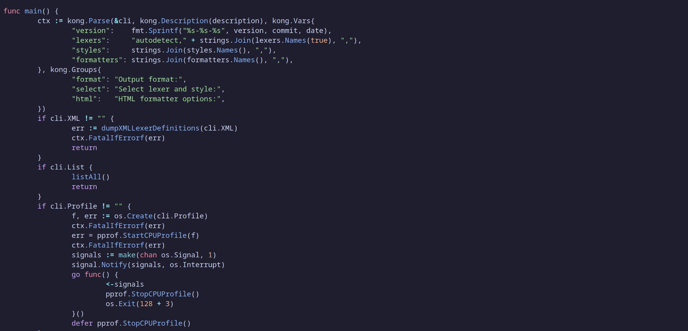
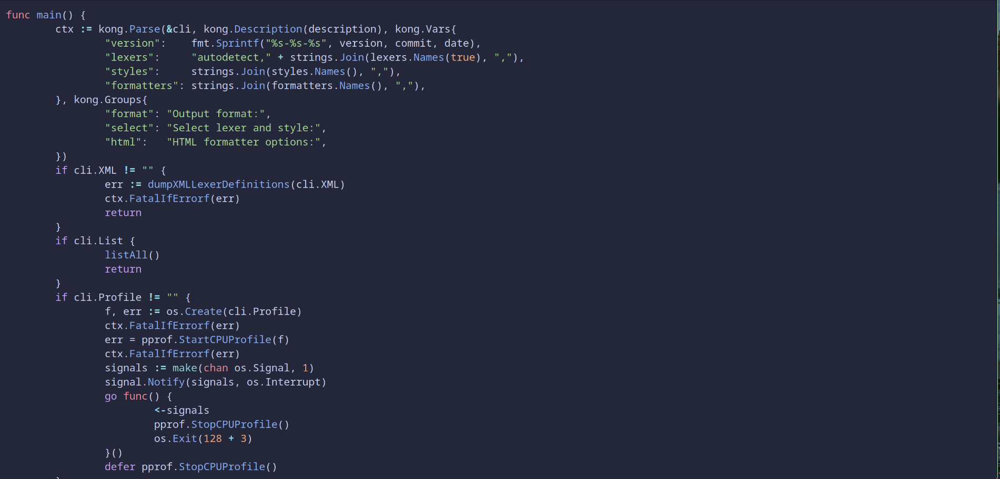
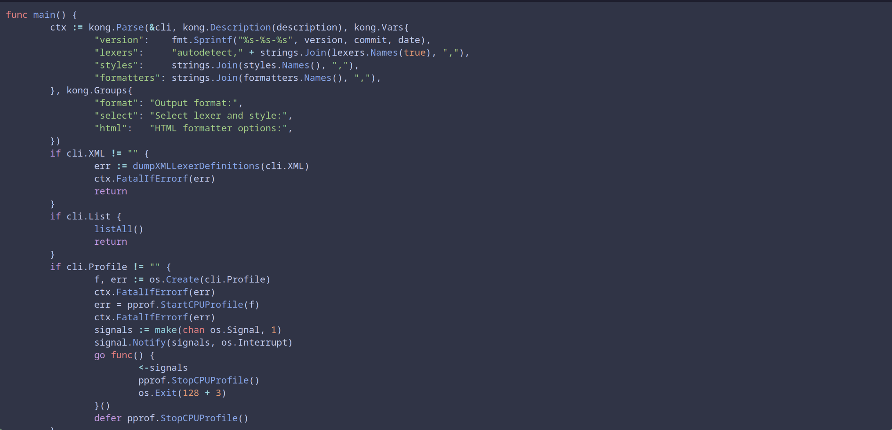
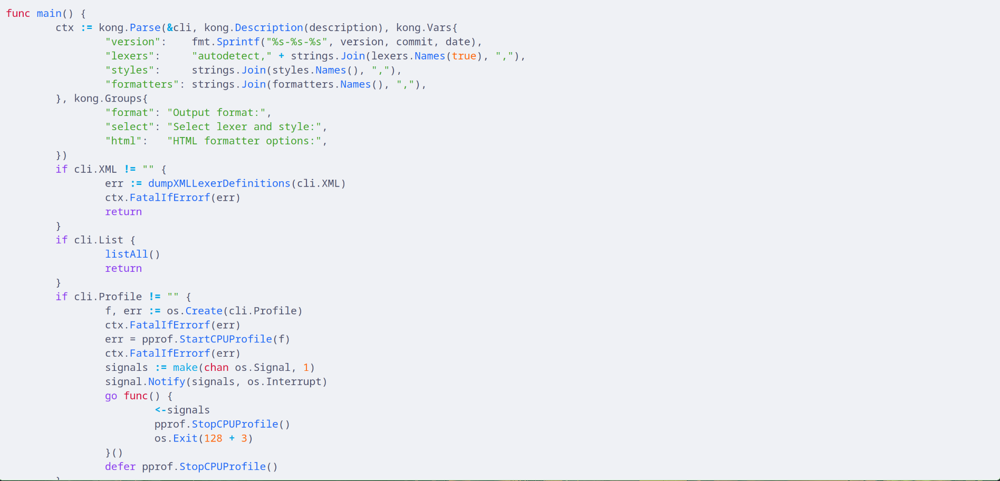

<pre align="center">
█▀▀ ▄▀█ ▀█▀ █▀█ █▀█ █░█ █▀▀ █▀▀ █ █▄░█
█▄▄ █▀█ ░█░ █▀▀ █▀▀ █▄█ █▄▄ █▄▄ █ █░▀█
</pre>

🌙 A simple Chroma theme based on the [Catppuccin](https://github.com/catppuccin/) color scheme!

No more client-side JS-based highlighting for a better dark highlighting theme with Hugo!

Feel free to open a Issue/PR for improvements!

# Screenshots
### Mocha


### Macchiato


### Frappe


### Latte


# Use with chroma CLI ⌨️

### Use the CSS Styles
- Specify the output format as `html` when invoking `chroma` with `chroma -f html`.
- Clear out the styles from the generated output, i.e. delete everything in between the opening and closing `<style>` tags.
- Then just copy and paste the contents of `dist/{desiredFlavour}-chroma-style.css` in the cleared space.
- You might need to adjust the body's text and background color yourself.

### Use the XML Styles
- Specify the path (on your device) to the `dist/{desiredFlavour}-chroma-style.xml` when invoking `chroma` with the `-s` flag.

# Use with Hugo 🛠️
- Set `markup.highlight.noClasses` to `false` in your Hugo config.
- Include the desired stylesheet — `dist/{desiredFlavour}-chroma-style.css` in your layouts, e.g. in a `head` partial to make it available on all pages.

# Build 🏗️
- Run `npm run build` inside project's root directory.
- You could also run `npm update -S` before running the build to use the latest Catppuccin colors.
- Look for `dist/{desiredFlavour}-chroma-style.{css|xml}` after successful build.

# CSS Reference 📙
To create a reference stylesheet of classes, run:
```
hugo gen chromastyles --style=monokai > sample.css
```

# Credits ⭐
- [JSS Project](https://github.com/cssinjs/jss)
- [Catppuccin Project](https://github.com/catppuccin/)