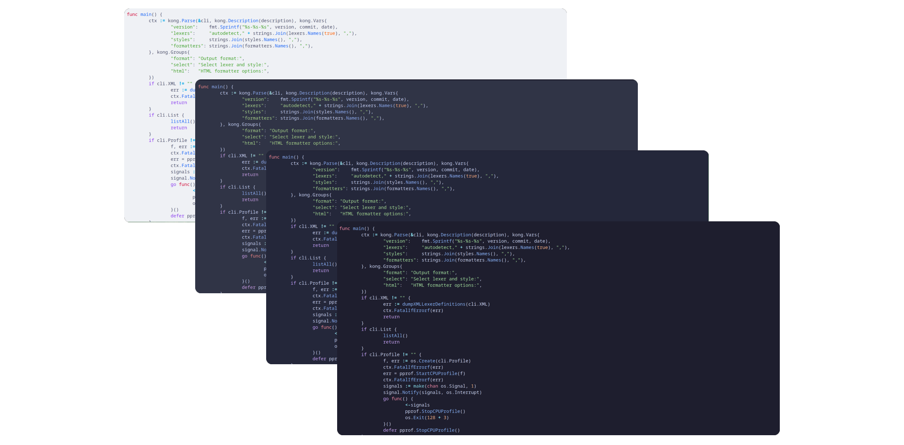
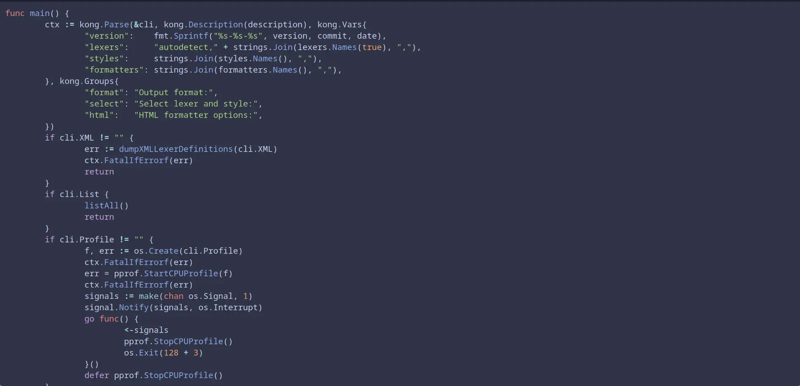
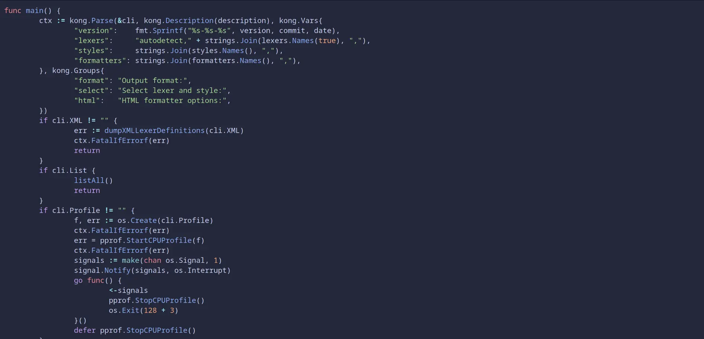
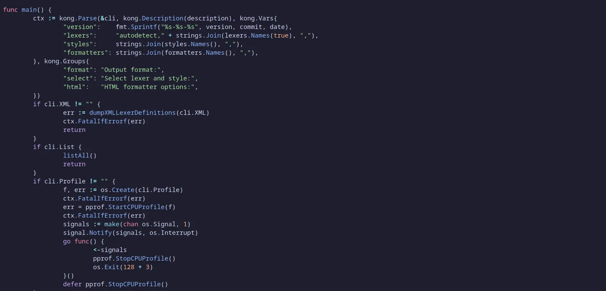

<h3 align="center">
	 
	
	Catppuccin for <a href="https://github.com/alecthomas/chroma">Chroma</a>
	
</h3>

	
	
	

	

## Previews

🌻 Latte

🪴 Frappé

🌺 Macchiato

🌿 Mocha

## Usage

### Chroma CLI

#### CSS Styles
	- Specify the output format as `html` when invoking `chroma` with `chroma -f html`.
	- Clear out the styles from the generated output, i.e. delete everything in between the opening and closing `<style>` tags.
	- Then just copy and paste the contents of `dist/{flavor}-chroma-style.css` in the cleared space.
	- You might need to adjust the body's text and background color yourself.

#### XML Styles
	- Specify the path (on your device) to the `dist/{flavor}-chroma-style.xml` when invoking `chroma` with the `-s` flag.

### Hugo 🛠️
	- Set `markup.highlight.noClasses` to `false` in your Hugo config.
	- Include the desired stylesheet — `dist/{flavor}-chroma-style.css` in your layouts, e.g. in a `head` partial to make it available on all pages.

## 💝 Thanks to

- [Aniket Teredesai](https://github.com/icy-comet)
- [JSS Project](https://github.com/cssinjs/jss)

&nbsp;

	

	Copyright &copy; 2021-present <a href="https://github.com/catppuccin" target="_blank">Catppuccin Org</a>

	

